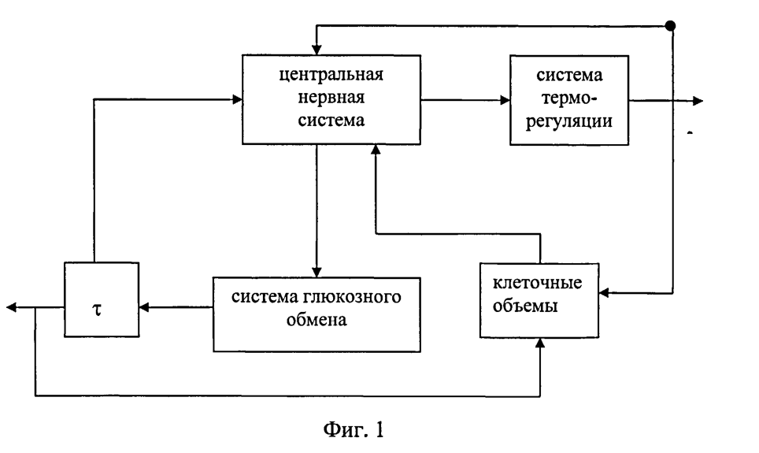

:imagesdir: images
:toc: macro
:icons: font
:figure-caption: Рисунок
:table-caption: Таблица
:stem: Формула

== Анализ требований

=== Задание

На основе теоретических и экспериментальных исследований процесса биохимического превращения глюкозы в крови человека, с помощью измерений температуры и тепловых потоков, необходимо разработать программное обеспечение для неинвазивного устройства позволяющее обеспечить непрерывный мониторинг биохимического превращения глюкозы в крови.

==== Теоретические исследования

В основу исследований были положены известные феноменологические представления об определяющей роли центральной нервной системы, обеспечивающей необходимый уровень активности обменных процессов в управлении метаболизмом клеточных объемов внутренних органов тела посредством регулирования интенсивности глюкозного обмена и температуры протекания биохимических превращений глюкозы в организме человека и, в частности, в его головном мозгу. (Г. Ульмер, Ф. Вальдек, О. Гарт, Г. Тевс. Физиология человека. - М., Мир, 1986, т.4, 312 с.).

Связи этих процессов можно представить в виде упрощенной функциональной схемы (см. фиг.1). 

[#Связи процессов теплообмена и обмена веществ в организме]
.Связи процессов теплообмена и обмена веществ в организме

Система терморегуляции получает из центральной нервной системы сигнал управления терморегуляцией stem:[U_T], а в результате своей работы возвращает в центральную нервную систему и клеточные объемы головного мозга значение температуры stem:[Т]. Система глюкозного обмена получает из центральной нервной системы сигнал управления глюкозным обменом stem:[U_y], а в результате своей работы выдает с временем задержки stem:[τ] значение концентрации глюкозы в крови stem:[G] в клеточные объемы головного мозга и центральную нервную систему. Метаболизм в клеточных объемах головного мозга stem:[М] зависит, в свою очередь, от значений stem:[Т] и stem:[G].(Ю.Г. Антомонов, С.И. Кефоренко, И.А. Микульская, И.К. Пароконная. Математическая теория системы сахара крови. - Киев: Наукова думка, 1971, гл.2. Элементы теории, с.15- 26). 

==== Экспериментальные исследования

При проведении исследований проведена компьютерная обработка получаемых экспериментальных данных для нахождения взаимосвязи таких параметров процесса, как значения температуры, теплового потока, их производных и временного смещения динамических значений температуры относительно концентрации глюкозы в крови при переходных процессах. 

Принципиальным результатом проведенных исследований является обнаружение функциональной связи гликемии крови stem:[G] с температурой stem:[Т], тепловым потоком stem:[F] при выраженном проявлении принципа упреждающего управления, результатом которого является опережающее изменение термических параметров при соответствующем изменении уровня гликемии крови: +
[#Формула функциональной связи гликемии с температурой и тепловым потоком]
.Формула функциональной связи гликемии с температурой и тепловым потоком
stem:[G(t)=ψ(T(t-τ),F(t-τ))], +
где stem:[τ] - время опережения отклонения температуры по отношению к отклонению гликемии.

На основе экспериментального обследования пациентов установлено, что величина stem:[τ] составляет порядка 10-30 минут, и это означает, что предлагаемый способ позволяет прогнозировать изменение гликемии крови и сигнализировать о приближении опасных состояний глюкозного обмена с опережением, достаточным для принятия мер стабилизации гликемии.

В результате применения способа было обнаружено влияние на измеряемые термические параметры некоторых индивидуальных факторов пациента. Для учета подобных факторов при вычислении гликемии крови проводилась предварительная персональная калибровка устройства (первичная калибровка при подлючении) для конкретного пациента с целью установления соответствующих параметров алгоритма, учитывающих индивидуальное влияние указанных факторов на результаты определения гликемии крови.

Для достоверного преобразования величин температуры и теплового потока в значения гликемии крови человека разработан функциональный алгоритм stem:[G=ψ(T, F, W)], построенный на основе функциональных связей, определяемых в результате решения системы дифференциальных уравнений, описывающих динамику рассматриваемого процесса с учетом индивидуальных факторов (stem:[W]), влияние которых определяют на основе персональной калибровки системы измерения для конкретного пациента с использованием инвазивных методов и приборов, проводимой с целью определения зависимостей от времени температуры, теплового потока и гликемии крови, необходимых для построения функционального алгоритма.

Система дифференциальных уравнений динамики процессов изменения температуры, теплового потока и концентрации глюкозы в крови в общем виде может быть представлена как +
[#Система дифференциальных уравнений для определения концентрации глюкозы в крови по температуре и тепловому потоку]
.Система дифференциальных уравнений для определения концентрации глюкозы в крови по температуре и тепловому потоку
stem:[X_g ^"*"=X_1 ^"*"+X_2 ^"*"], +
где stem:[X_g ^"*"=(∆X_g)/X_(g0)] - безразмерное отклонение концентрации глюкозы в крови от установившегося значения; +
stem:[X_1 ^"*"=K_(ТП) W_(ТП)(s)X_T ^"*"]; +
stem:[X_2 ^"*"=K_(П) W_(ТП)(s)X_П ^"*"]; +
stem:[X_Т ^"*"=(∆X_Т)/X_(Т0)] - безразмерное отклонение температуры от установившегося значения; +
stem:[X_П ^"*"=(∆X_П)/X_(П0)] - безразмерное отклонение теплового потока от установившегося значения; +
stem:[X_(g0), X_(Т0),X_(П0)] - установившиеся базовые значения концентрации глюкозы крови, температуры и теплового потока тела соответственно; +
stem:[∆X_g=X_g-X_(g0)]; +
stem:[∆X_Т=X_Т-X_(Т0)]; +
stem:[∆X_П=X_П-X_(П0)]; +
stem:[X_g, X_Т,X_П] - текущие значения концентрации глюкозы крови, температуры и теплового потока;  +
stem:[W_(ТП)(s)=e^(-τs)] - передаточная функция концентрации глюкозы в крови по температуре и тепловому потоку; +
stem:[K_П, K_(ТП)] - экспериментально определяемые безразмерные коэффициенты; + 
stem:[s=d/(dt)] - оператор дифференцирования; +
stem:[τ] - экспериментально определяемое чистое запаздывание измерения глюкозы крови относительно отклонения температуры.

Предложенный способ подтвержден примерами.

*_Пример 1_* +
Проводились измерения температуры  и с использованием функционального алгоритма вычислялась концентрация глюкозы в крови у больного А, страдающего диабетом. Параллельно проводились измерения концентрации глюкозы крови у этого больного инвазивным прибором "ONE TOUCH". В начале сеанса измерений испытуемый пообедал. Результаты измерений и расчета приведены в таблице 1. +
Полученное время опережения изменения температуры и изменения гликемии stem:[τ] равнялось 10 минутам. Из сравнения результатов измерений концентрации глюкозы крови, определенных предложенным способом и инвазивным методом видно, что они отличаются не более чем на 10%.

[#Результаты экспериментальных исследований. Пациент с диабетом, после обеда]
.Результаты экспериментальных исследований. Пациент с диабетом, после обеда
[options="header"]
[cols="5,2,2,2,2,2,2,2"]
|=====================
|*Измеренная температура, С*|36,650|36,920|37,235|37,395|37,430|37,401|37,440
|*Рассчитанные величины концентрации глюкозы, Моль/л*|2,4|5,6|9,0|10,5|10,9|10,7|11,0
|*Измеренные величины концентрации глюкозы, Моль/л*|2,6|5,7|8,2|10,9|10,8|11,7|10,7
|=====================

*_Пример 2_* +
Проводились измерения температуры и теплового потока, и с использованием функционального алгоритма вычислялась концентрация глюкозы в крови у пациента Б, не страдающего диабетом. Параллельно проводились измерения концентрации глюкозы крови у этого испытуемого инвазивным прибором "ONE TOUCH". В начале испытания испытуемый выпил стакан сладкого чая. Результаты измерений и расчета приведены в таблице 2. +
Время опережения stem:[τ] равнялось 14 минутам. Из сравнения результатов измерений концентрации глюкозы крови, определенных предложенным способом и инвазивным методом видно, что они отличаются не более чем на 10%.

[#Результаты экспериментальных исследований. Пациент без диабета, выпил стакан сладкого чая]
.Результаты экспериментальных исследований. Пациент без диабета, выпил стакан сладкого чая
[options="header"]
[cols="5,2,2,2,2,2,2,2"]
|=====================
|*Измеренная температура, С*|36,747|36,756|37,756|37,750|37,765|37,776|37,826
|*Рассчитанные величины концентрации глюкозы, Моль/л*|4,2|4,3|4,3|4,3|4,4|4,6|5,2
|*Измеренные величины концентрации глюкозы, Моль/л*|4,4|4,5|4,5|4,7|4,9|4,9|5,2
|=====================
[cols="5,2,2,2,2,2,2,2"]
|=====================
|*Измеренная температура, С*|36,874|36,921|36,918|36,891|36,783|36,705|36,668
|*Рассчитанные величины концентрации глюкозы, Моль/л*|5,8|6,4|6,4|6,0|4,7|3,5|3,1
|*Измеренные величины концентрации глюкозы, Моль/л*|5,4|5,8|5,7|5,4|4,7|3,5|3,1
|=====================

==== Общие требования 

[#Общие требования]
.Общие требования
[options="header"]
[cols="1,1"]
|=====================
|Параметр, характеристика |Требование
|*Отладочная плата*|XNUCLEO-F411RE
|*Способ измерения температуры*|инфракрасный датчик температуры
|*Период измерения*|часто-прерывисто каждые 5 минут
|*Общение сдатчиком*|интерфейс SMBus
|*Точность измерения температуры*|не менее 0,01 °С
|*Выод значений температуры*| интерфейс USART2
|*Передача значений по беспроводному интерфейсу*|BlueTooth Bee HC-06
|*Язык приложения, компилятор*|C++, ARM 8.40.2
|=====================

Формат вывода: +
"Температура:"ХХХ.ХХ[Units]

Архитектура должна быть представлена в виде UML диаграмм в пакете Star UML. 

При разработке должна использоваться Операционная Система Реального Времени FreeRTOS и RtosWrapper.

=== Окружение программы

//[#Окружение программы или структурная схема устройства]
//.Окружение программы или структурная схема устройства
//image::Structura.png[]

[#Описание окружения]
.Описание окружения
[options="header"]
[cols="1,1"]
|=====================
|Блок |Описание
|*Прецизионный термо-чувствительный кварцевый резонатор*|Модуль используется для считывания данных о температуре в окружающей среде/с поверхности кожи человека.
|*Таймер*|Таймер используется для преобразования частоты в информацию о температуре
|*Микроконтроллер*|STM32F411RE с ядром Cortex-M4 предназначен для управления периферийными устройствами. Содержит микропроцессор, ОЗУ и ПЗУ. Есть встроенный АЦП
|*Bluetooth Bee HC-06*|Модуль подключается по UART-интерфейсу к разъемам RX и TX. Обеспечивает беспроводную передачу данных
|*Приемник информации*|Внешнее устройство (в данной работе не рассматривается)
|=====================

=== Используемое оборудование
В качестве датчиков используют бесконтактные датчики температуры и теплового потока или контактные Z-термисторы, которые фиксируют на теле с помощью упругого элемента, либо приклеивают к коже и изолируют от внешней среды тепловой изоляцией. Характеристики датчика представлены в таблице ниже.

Для данной работы в качестве датчика температуры будет использоваться прецизионный термочувствительный кварцевый резонатор РКТ 206, так как он имеет следующие достоинства:

* высокая ударная и вибрационная прочность;
* миниатюрный размер;
* низкое энергопотребление;
* высокая разрешающая способность;
* возможность использования в оборудовании для высокоточного измерения температуры.

Технические характеристики устройства представлены ниже в таблице.

[#Характеристики  датчика температуры]
.Характеристики датчика температуры
[options="header"]
[cols="7,5,2"]
|=====================
|Параметр|Технические требования и замечания|Величина
|*Диапазон частот (основная гармоника), stem:[f_0]*|32.000...45.000|кГц
|*Точность настройки тип./макс., stem:[f/(f_0)]*|±30...±1000|РРМ
|*Динамическое сопротивление тип/макс., stem:[R_K]*|75/95|кОм
|*Статическая емкость тип., stem:[C_0]*|1.3 ± 0.2|пФ
|*Емкостное отношение (коэффициент)*|900 ± 250|-
|*Уровень возбуждение макс., stem:[w]*|1.0|мкВт
|*Сопротивление изоляции мин, stem:[IR]*|500|МОм
|*Опорное значение температуры*|50|°С
|*Разрешающая способность*| до 0,01|°С
|=====================

[#Условия эксплуатации датчика температуры]
.Условия эксплуатации датчика температуры
[options="header"]
[cols="7,5,2"]
|=====================
|*Диапазон рабочих температур, stem:[T_(OPR)]*|-60...+100|°С
|*Ударная прочность, stem:[(dF)/(F_0)]* (Ускорение 5000g при длительности 0,2 мс)|±15 max|РРМ
|*Вибрационная устойчивость, stem:[(dF)/F]* (Вибрация от 10 до 2000 Гц с ускорением 10g в течение 8 часов)|±15 max|РРМ
|=====================

Микроконтроллер STM32F411RE с ядром Cortex-M4 и со встроенным 12 битным АЦП. 

Для передачи данных по беспроводному интерфейсу будет использован модуль Bluetooth Bee HC-06.

=== Формулы для устройства

==== Функция преобразования датчика температуры

Для считывания температуры с термо-чувствительного резонатора необходимо провести некоторые преобразования полученных данных по следующим формулам: +
[#Функция зависимости частоты от температуры]
.Функция зависимости частоты от температуры
stem:[f_T=f_0+А_1(Т-Т_0)+А_2(Т-Т_0)^2+A_3(T-T_0)^3], (ppm), +
где stem:[f_Т] - частота резонатора при текущем значении температуры stem:[Т] (°С), +
stem:[f_0] - частота резонатора при опорном значении температуры stem:[Т] (°С), +
stem:[Т_0] - опорное значение температуры (°С).

NOTE: Значения величин параметров можно увидеть в таблицах с техническими характеристиками и условиями эксплуатации на прецизионный термочувствительный кварцевый резонатор. Значения коэффициентов для функций преобразования определяются при изготоалении резонатора и представлены в таблице ниже.

[#Коэффициенты функции преобразования]
.Коэффициенты функции преобразования
[options="header"]
[cols="7,5,2"]
|=====================
|*Коэффициент 1-го порядка, stem:[А_1]*|-1,811 ± 0,061|stem:[(°С^(-1)]
|*Коэффициент 2-го порядка, stem:[А_2]*|-0,0028 ± 0,0001|stem:[°С^(-2)]
|*Коэффициент 2-го порядка, stem:[А_3]*|stem:[7,6*10^(-6)]|stem:[°С^(-3)]
|=====================
WARNING: _коэффициенты stem:[А_1], stem:[А_2] и stem:[A_3] могут быть изменены заказчиком устройства._

==== Преобразование температуры в глюкозу
Непрерывный или часто-прерывистый мониторинг концентрации глюкозы в крови, включающий неинвазивное измерение с помощью датчиков измерительного устройства температуры, тепловых потоков и косвенного определения концентрации глюкозы в крови проводят по формуле: +
[#Преобразование температуры в глюкозу]
.Преобразование температуры в глюкозу
stem:[X_g ^"*"=X_1 ^"*"+X_2 ^"*"], +
где stem:[X_1 ^"*"=K_(ТП) W_(ТП)(s)X_T ^"*"], +
stem:[X_2 ^"*"=K_П W_(ТП)(s)X_T ^"*"], +
где stem:[X_Т ^"*] - безразмерное отклонение температуры от установившегося значения, + 
stem:[X_П ^"*"] - безразмерное отклонение теплового потока от установившегося значения, +
stem:[W_(ТП)(s)=e^(-τs)] - передаточная функция концентрации глюкозы в крови по температуре и тепловому потоку, +
stem:[τ] - запаздывание изменения глюкозы крови относительно отклонения температуры, + 
stem:[K_(ТП), K_П] - калибровочные коэффициенты, +
stem:[s=d/(dt)] - оператор дифференцирования, +
stem:[dt] - время прошедшее после предыдущего измерения (период), +
при этом настройку калибровочных коэффициентов и времени запаздывания производят в автоматическом режиме по периодически поступающим в вычислительный блок устройства неинвазивного определения концентрации глюкозы в крови данных полученных инвазивным путем, для чего вычислительный блок неинвазивного измерительного устройства соединяют с инвазивным глюкометром по беспроводной сети Bluetooth.
