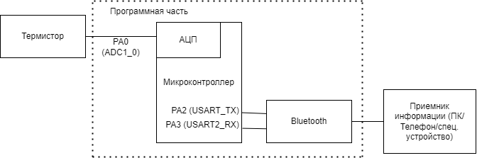

:toc: macro
:icons: font
:figure-caption: Рисунок
:table-caption: Таблица

== Анализ требований

=== (другое)

Необходимо создать устройство "неинвазивный глюкометр", который с помощью метода  термоспектроскопии определяет уровень глюкозы в крови человека, и передает полученные данные по Bluetooth

=== Исходные данные (ТЗ)

=== Окружение программы

[#Окружение программы или структурная схема устройства]
.Окружение программы или структурная схема устройства

=== Используемое оборудование

==== Термистор (Z-термистор) 
//или взять из описания на плату

==== Микроконтроллер со встроенным АЦП

==== Bluetooth-модуль

=== Выводы
